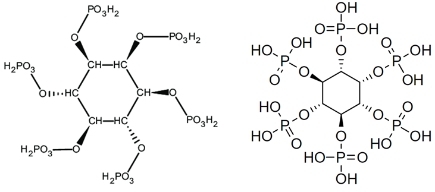

### Что такое фитиновая кислота?

Фитиновая кислота, также известная как **фитат**, - это вещество, которое накапливается в семенах и оболочке растений. Этого вещества больше в бобовых, масличных семенах и орехах, и оно оказывает вредное воздействие на организм. Фитиновая кислота **препятствует усвоению** таких важных минералов, как **кальций, цинк, магний, медь и железо**. Поэтому ее также называют антипитательным веществом.

Фитиновая кислота, также называемая полифосфатом инозитола, представляет собой фосфорсодержащую форму химической молекулы инозитола. Другими словами, фитиновая кислота - это форма хранения фосфора в семенах и оболочках растений. Когда семя прорастает, фитиновая кислота разрушается и высвобождает необходимый растению фосфор. Эта кислота, присутствующая во многих продуктах питания, может привести к дефициту в организме таких минералов, как цинк, кальций и железо. Поэтому фитиновая кислота считается веществом  вредным.